# Análise de Dados do Enem 2022

Este repositório tem como objetivo armazenar o projeto desenvolvido no  módulo "Vizualização de Dados com Power BI" do Curso de Especialização  "Vem Ser Tech - Data Analystic", desenvolvido pela [ADA](https://ada.tech/) em parceria com o [Ifood](https://www.ifood.com.br/). O curso foi guiado pela instrução do professor [Bruno Trindade](https://www.linkedin.com/in/brunotrbr/).

O projeto foi um requisito essencial para a aprovação no módulo e encerra a cadeia de disciplinas que fizeram parte da formação em Data Analystic da ADA, consolidando o aprendizado prático dos participantes e preparando-os para o mercado de trabalho.

Este repositório tem por objetivo trazer insights pertinentes ao Exame Nacional do Ensino Médio (ENEM) de 2022, trazendo insights sobre os incritos, análise de absenteísmo dos estudantes, desempenho dos participantes e exploração de dados socioeconômicos e geográficos.

A análise foi projetada para ser vizualizada no formato de "Dashboard´s" no [Power BI](https://www.microsoft.com/pt-br/power-platform/products/power-bi) da [Microsoft](https://www.microsoft.com/pt-br), permitindo a demonstração dos resultados através de painéis interativos facilitando o entendimento do público.

## Contextualização

Como Secretário do Ministério da Educação estou profundamente envolvido na melhoria contínua da qualidade da educação no Brasil. Uma parte crucial do meu trabalho é entender o desempenho dos estudantes no Exame Nacional do Ensino Médio (ENEM) de 2022.

Para facilitar meu trabalho e apresentar soluções para moldar políticas educacionais gostaria de obter informações sobre esses temas:

- Desempenho dos Estudantes: Analisar as notas dos estudantes em diferentes disciplinas para identificar áreas onde os estudantes estão se saindo bem e onde eles podem precisar de mais apoio.

- Tendências Geográficas: Examinar o desempenho dos estudantes com base em sua localização geográfica. Isso pode ajudar a identificar regiões que podem precisar de mais recursos educacionais.

- Dados Socioeconômicos: Explorar a relação entre o desempenho dos estudantes e seus antecedentes socioeconômicos. Isso pode fornecer insights sobre como fatores externos podem estar afetando o desempenho dos estudantes.

## Dataset

Os dados utilizados neste projeto são os [Micodados do ENEM 2022](https://www.gov.br/inep/pt-br/acesso-a-informacao/dados-abertos/microdados/enem). Os microdados do Enem são o menor nível de desagregação de dados recolhidos por meio do exame. Eles atendem a demanda por informações específicas ao disponibilizar as provas, os gabaritos, as informações sobre os itens, as notas e o questionário respondido pelos inscritos no Enem.

## Projeto

### Fluxograma do Projeto

  

### ETL

Para otimizar o desempenho no Power BI, inicialmente, realizamos a leitura do arquivo CSV utilizando a biblioteca Pandas. Isso nos permitiu reduzir o número de colunas, focando apenas naquelas que são relevantes para a nossa análise.

**Antes:**

  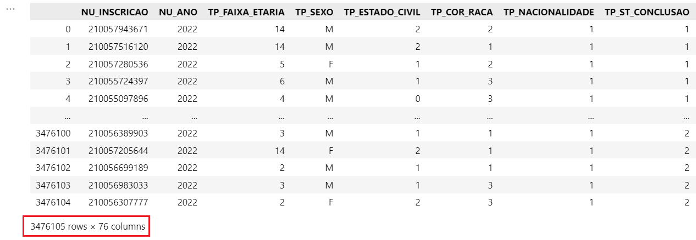

**Depois:**

  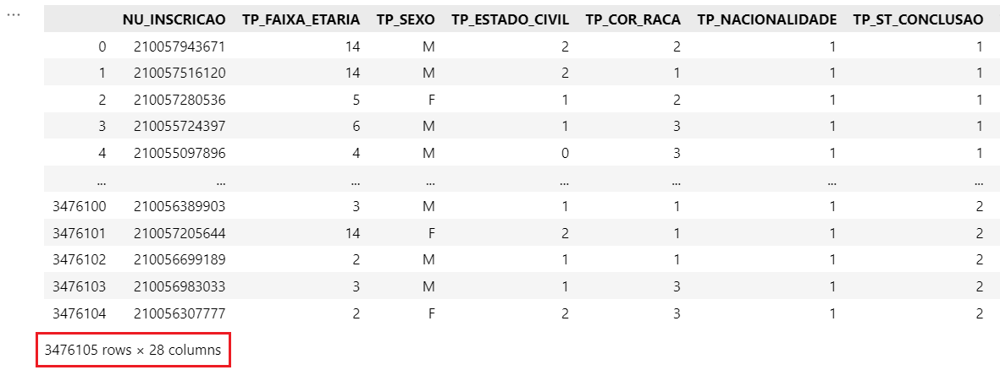

Após essa etapa, foi possível exportar um conjunto de dados que inclui as colunas relevantes para nossa análise, bem como o total de inscritos no ENEM.

Posteriormente, para facilitar o processamento no Power BI, limitamos o conjunto de dados a uma amostra de 100.000 instâncias. 

Com essas etapas finalizadas foi possível obter um dataset completo e outro filtrado que foram usados como parâmetros para a troca do Dataset no Power BI.

Gostaria de destacar que essas etapas foram cruciais para garantir uma análise eficiente e ágil.

### Recategorização de Variáveis

Outro aspecto importante do nosso trabalho foi a recategorização de algumas variáveis do conjunto de dados. Enfrentamos um desafio com variáveis que continham múltiplas categorias, resultando em visualizações excessivamente complexas que dificultavam a interpretação gráfica pelos stakeholders.

Para resolver essa questão, optamos pela desnormalização dos dados, aplicando uma modelagem dimensional que reduziu efetivamente o número de categorias. Isso simplificou nossas visualizações, tornando-as mais acessíveis e compreensíveis para os stakeholders.

**Antes:**

  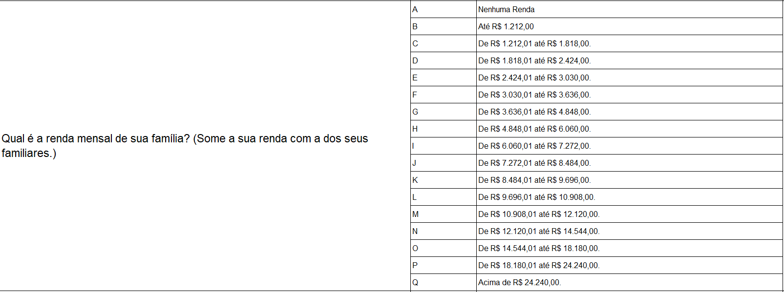

**Depois:**

  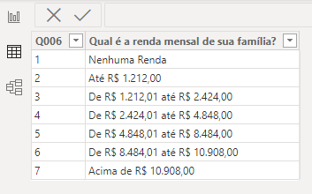

### Modelagem

Optou-se pela modelagem dimensional do conjunto de dados, especificamente utilizando o modelo Snowflake. Essa abordagem nos permitiu estruturar os dados de forma otimizada para análises complexas e ágeis. Com o Snowflake, conseguimos implementar um possível ambiente de data warehousing altamente escalável e flexível.

  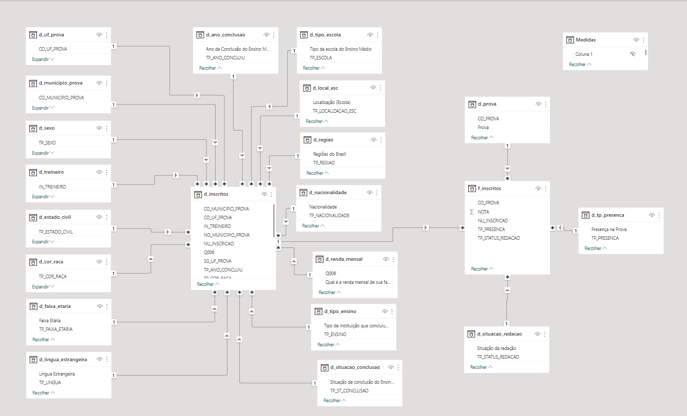

### Dashboard: Inscritos

Nesta visualização, conseguimos extrair alguns insights significativos, como:

1. A proporção de mulheres que realizam o ENEM é superior à dos homens. Isso pode ser atribuído ao fato de que, de acordo com o Censo de 2022, há um maior número de mulheres no Brasil, o que se reflete nos participantes do ENEM. Além disso, é importante destacar a crescente participação das mulheres no mercado de trabalho, muitas das quais buscam construir carreiras sustentadas por uma formação acadêmica sólida.

2. O percentual de inscritos do Nordeste é maior que o Sudeste. Esse dado traz a região Nordeste para um ponto de destaque em políticas educacionais futuras.

3. A maior parcela da população de inscritos participam de famílias com renda per capita de até um salário mínimo. Esse dado reflete a vulnerabilidade econômica que enfrentamos no país nos diversos setores da sociedade.

  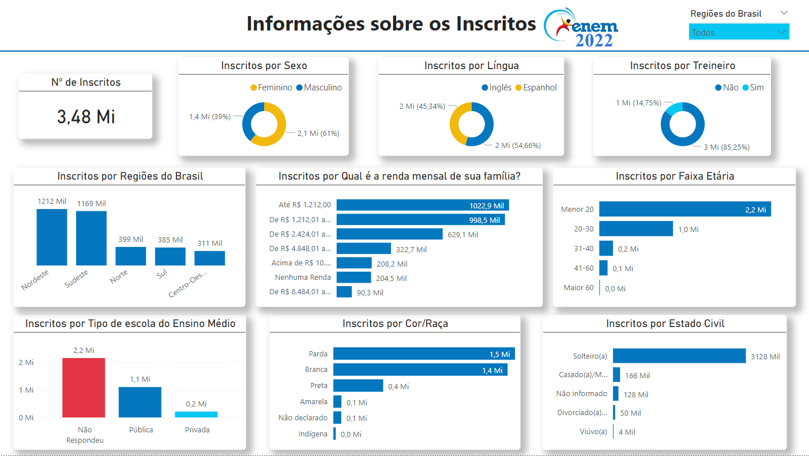

### Dashboard: Absenteísmo

Nesta visualização, conseguimos extrair alguns insights significativos, como:

1. Os dados de absenteísmo parecem seguir uma proporção semelhante aos dados de inscrito. Por exemplo, o número de mulheres que faltaram ao exame é proporcional ao número de mulheres inscritas. 

2. O segundo dia de prova, que abrange Ciências da Natureza e Matemática, apresenta um percentual maior de faltas. Isso pode ser atribuído ao chamado “efeito do segundo dia de prova”, onde um desempenho insatisfatório no primeiro dia pode levar à desistência do estudante. Além disso, o fato de que as disciplinas do segundo dia são voltadas para as ciências exatas, áreas em que os estudantes geralmente enfrentam mais dificuldades, também pode contribuir para esse fenômeno.

  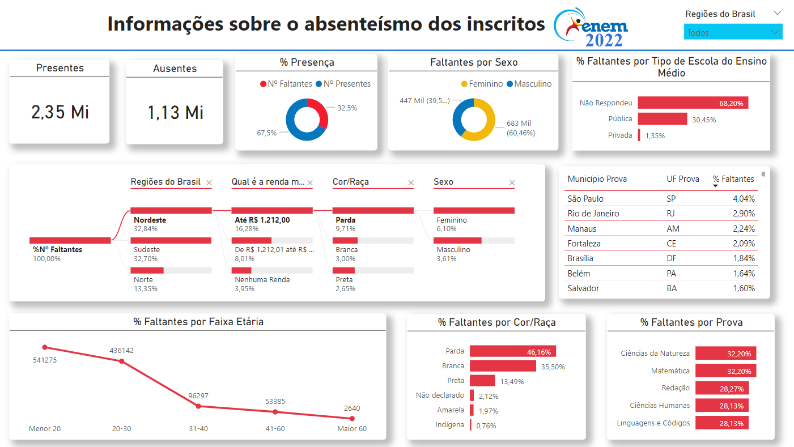

### Dashboard: Resultados

  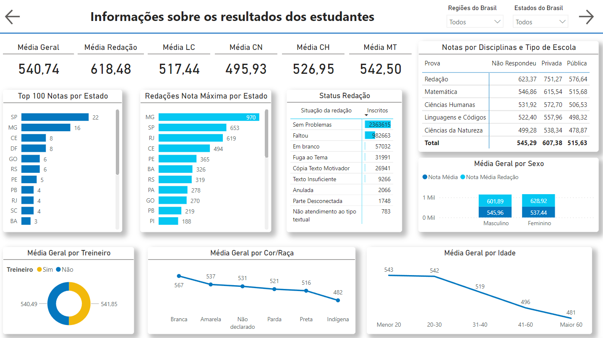

### Dashboard: Insight 1

  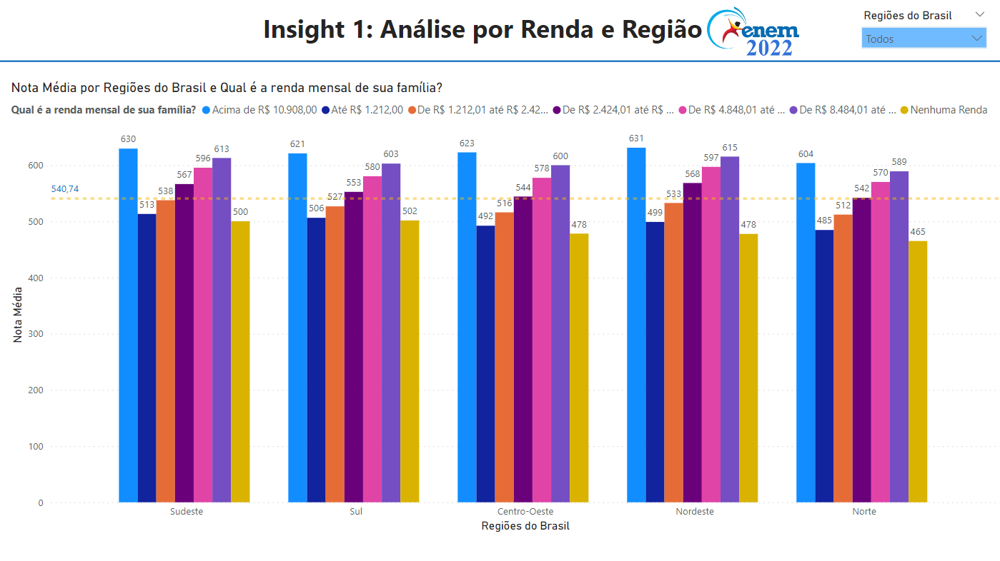

### Dashboard: Insight 2

  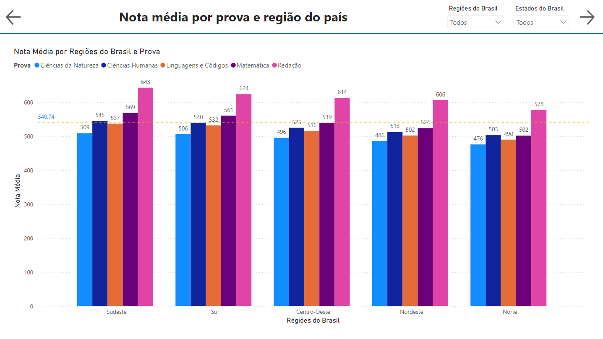

### Dashboard: Insight 3

  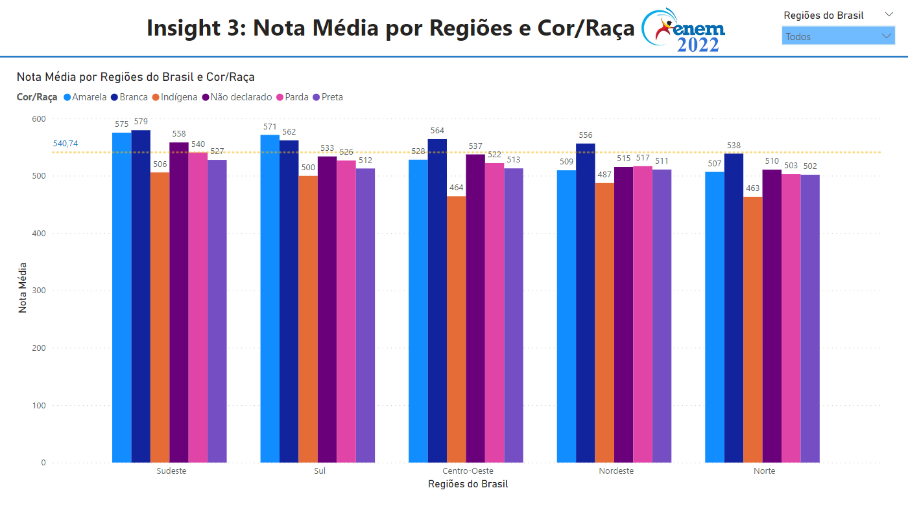

## Links Úteis:

- [INEP ENEM](https://www.gov.br/inep/pt-br/areas-de-atuacao/avaliacao-e-exames-educacionais/enem)

- [Documentação do Power BI](https://learn.microsoft.com/pt-br/power-bi/)

## Tecnologias Utilizadas

- Microsoft Power BI
- Python (Pandas)
- Microsoft Excel

## Contributions

Contributions are welcome. Feel free to suggest improvements and possible fixes to the code through an issue or pull requests.

## Author

Jadeson Bruno Albuquerque da Silva

